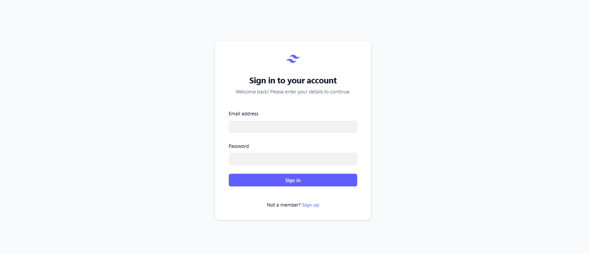
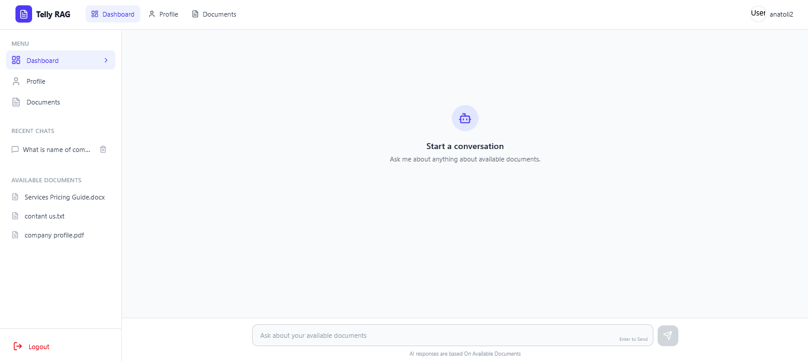
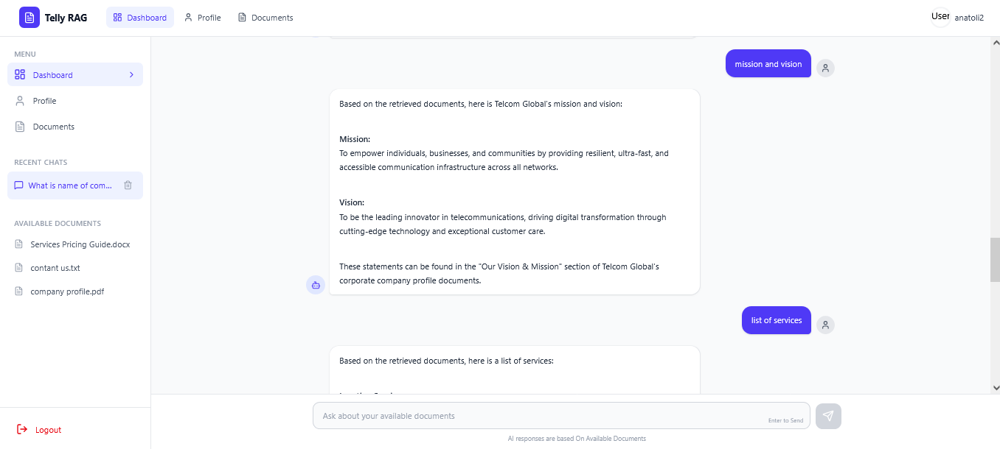
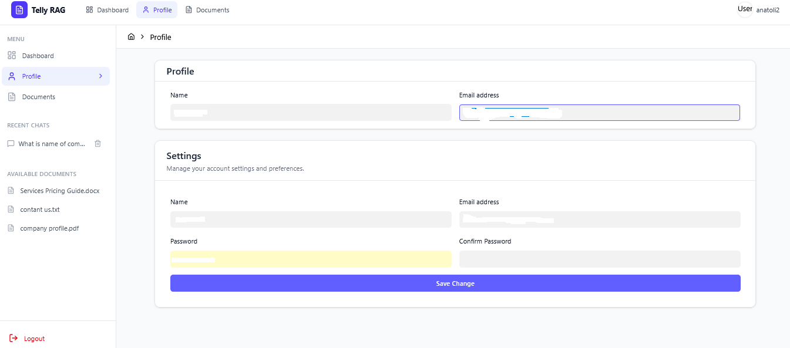
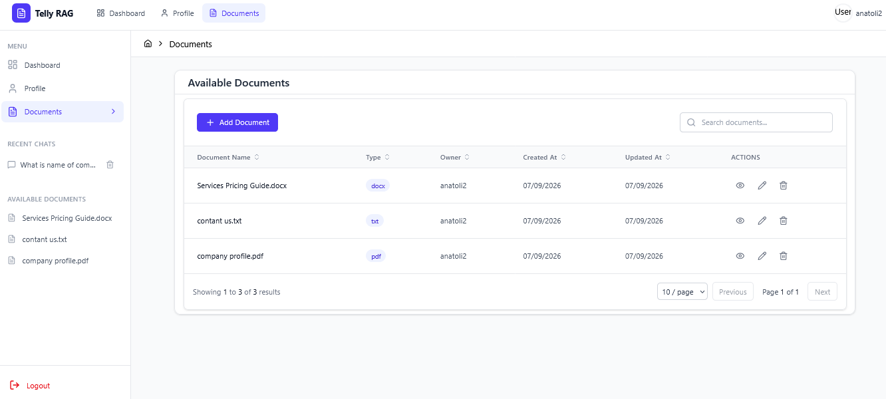

# Telly RAG

Telly RAG is an AI-assisted, document-aware chat application. Users can create an account, upload documents, ask questions about their documents, maintain separate chat conversations, and request a document by email.
## Screenshots
<table> <tr> <td align="center" width="50%"> <strong>Login Page</strong><br><br>  </td> <td align="center" width="50%"> <strong>Chat Panel</strong><br><br>  </td> </tr> <tr> <td align="center" width="50%"> <strong>Chat Board</strong><br><br>  </td> <td align="center" width="50%"> <strong>Profile & Settings</strong><br><br>  </td> </tr> <tr> <td align="center" width="50%"> <strong>Documents Management</strong><br><br>  </td> <td width="50%"></td> </tr> </table>

The project is split into two applications:

- `backend/` - FastAPI API, PostgreSQL persistence, Redis caching, Celery tasks, Chroma vector storage, and OpenRouter-powered responses.
- `frontend/` - React and Vite web application for authentication, document management, and chat.

## Features

- User registration, login, profile retrieval, and profile updates.
- JWT-protected chat and document workflows.
- Document upload for PDF, DOCX, TXT, and Markdown files.
- Background document ingestion and embedding with Celery.
- Semantic retrieval with Chroma and Hugging Face embeddings.
- AI answers grounded in retrieved document context.
- Markdown rendering for formatted AI answers.
- Separate chat history for each conversation.
- Redis-backed chat history caching.
- Chat deletion with database and cache cleanup.
- Document replacement, re-ingestion, deletion, and vector cleanup.
- Optional document email delivery through the configured SMTP server.
- OpenRouter retry and fallback-model handling for transient provider rate limits.

## Architecture

```text
React/Vite frontend
        |
        | HTTP JSON, multipart uploads, JWT
        v
FastAPI backend
   |         |          |
   |         |          +--> Redis cache
   |         +-------------> PostgreSQL
   +-----------------------> OpenRouter LLM
   |
   +--> Chroma vector store
   |
   +--> Celery tasks --> Redis broker/result backend
```

### Chat request flow

1. The frontend sends a message to `POST /api/chats/{chat_id}/messages`.
2. The backend stores the user message and reads recent conversation history.
3. A local request classifier decides whether the request needs document retrieval or an email action.
4. Relevant document chunks are retrieved from Chroma.
5. Normal questions are sent to the LLM with the retrieved context.
6. Explicit email requests use the tool-enabled agent with document lookup and email tools.
7. The assistant response is normalized, stored, cached, and returned to the frontend.

The request classifier is local and does not make a separate LLM request. This keeps normal conversations cheaper and avoids an unnecessary provider call.

## Prerequisites

Install the following before starting:

- [Git](https://git-scm.com/)
- Python 3.12 or newer
- Node.js 22 or newer, including npm
- PostgreSQL 15 or newer
- Redis 7 or newer
- An [OpenRouter API key](https://openrouter.ai/keys)
- A working SMTP account if document email delivery is required

## Run after cloning

Clone the repository and open it:

```bash
git clone <repository-url>
cd Telly-RAG
```

The directory name may differ depending on where the repository is cloned.

### 1. Create PostgreSQL database

Create a PostgreSQL database and user with permission to access it. For example:

```sql
CREATE USER telly_rag WITH PASSWORD 'change-this-password';
CREATE DATABASE telly_rag OWNER telly_rag;
```

You can also use an existing PostgreSQL database. Record the host, port, database name, username, and password for the backend configuration.

### 2. Start Redis

Redis is used for chat caching and Celery task coordination. With Docker:

```bash
docker run --name telly-rag-redis -p 6379:6379 redis:7-alpine
```

If the container already exists, start it with:

```bash
docker start telly-rag-redis
```

Keep Redis running while using the application.

### 3. Configure the backend

The backend reads configuration from `backend/.env`. Create that file manually because this repository does not include a checked-in environment template.

Example `backend/.env`:

```env
APP_NAME=Telly RAG
APP_VERSION=1.0.0
ENVIRONMENT=development
DEBUG=true

JWT_SECRET_KEY=replace-with-a-long-random-secret
JWT_ALGORITHM=HS256
ACCESS_TOKEN_EXPIRE_MINUTES=60

CORS_ORIGINS=http://localhost:5173
CORS_ALLOW_CREDENTIALS=true

DB_HOST=localhost
DB_PORT=5432
DB_NAME=telly_rag
DB_USER=telly_rag
DB_PASSWORD=change-this-password
DB_ECHO=false

OPENROUTER_API_KEY=replace-with-your-openrouter-key
OPENROUTER_BASE_URL=https://openrouter.ai/api/v1
OPENROUTER_MODEL_NAME=your-preferred-model
OPENROUTER_FALLBACK_MODEL_NAME=openrouter/auto

LANGSMITH_TRACING=false
LANGSMITH_ENDPOINT=https://api.smith.langchain.com
LANGSMITH_API_KEY=
LANGSMITH_PROJECT=telly-rag

CELERY_BROKER_URL=redis://localhost:6379/0
CELERY_RESULT_BACKEND=redis://localhost:6379/1
CELERY_TASK_ALWAYS_EAGER=true
CELERY_BROKER_CONNECTION_TIMEOUT=5
CELERY_BROKER_CONNECTION_MAX_RETRIES=1
CELERY_TIMEZONE=Africa/Nairobi

EMAIL_ENABLED=false
EMAIL_HOST=smtp.example.com
EMAIL_PORT=587
EMAIL_USER=
EMAIL_PASS=
EMAIL_FROM=
EMAIL_FROM_NAME=Telly RAG

REDIS_URL=redis://localhost:6379/2
```

Use a strong, unpredictable value for `JWT_SECRET_KEY`. Never commit the `.env` file or real API keys.

Create and activate a virtual environment:

```bash
cd backend
python -m venv .venv
```

Windows PowerShell:

```powershell
.\.venv\Scripts\Activate.ps1
pip install -r requirements.txt
```

macOS/Linux:

```bash
source .venv/bin/activate
pip install -r requirements.txt
```

Start the API from the `backend` directory:

```bash
uvicorn app.main:app --reload --host 0.0.0.0 --port 8000
```

The first startup creates the database tables. Verify the API:

- Health check: [http://localhost:8000/health](http://localhost:8000/health)
- API root: [http://localhost:8000/](http://localhost:8000/)
- Swagger UI: [http://localhost:8000/docs](http://localhost:8000/docs)

### 4. Run Celery

Open another terminal, activate the same virtual environment, change to `backend`, and run the worker:

```bash
celery -A app.celery_app.celery_app worker --loglevel=info
```

The worker processes document ingestion, embedding generation, and mail-related tasks. For scheduled tasks, start Celery Beat in another terminal:

```bash
celery -A app.celery_app.celery_app beat --loglevel=info
```

In development, `CELERY_TASK_ALWAYS_EAGER=true` runs tasks in the API process. A separate worker is still recommended when testing the full asynchronous setup.

### 5. Configure and run the frontend

The frontend uses the API base URL from `frontend/.env`. Create the file with:

```env
VITE_API_BASE_URL=http://localhost:8000/api
```

Install dependencies and start Vite:

```bash
cd frontend
npm install
npm run dev
```

Open the URL printed by Vite, normally [http://localhost:5173](http://localhost:5173).

Recommended first workflow:

1. Register a user.
2. Log in.
3. Upload a PDF, DOCX, TXT, or Markdown document.
4. Wait for ingestion to complete.
5. Create a chat and ask a question about the uploaded document.

## Configuration reference

All backend variables are case-insensitive because they are loaded by Pydantic Settings. The following names match the settings used by the application.

| Variable | Purpose |
| --- | --- |
| `APP_NAME`, `APP_VERSION`, `ENVIRONMENT` | Application identity and runtime environment. |
| `DEBUG` | Enables debug logging and development diagnostics. |
| `JWT_SECRET_KEY` | Secret used to sign access tokens. Required. |
| `JWT_ALGORITHM` | JWT signing algorithm, normally `HS256`. |
| `ACCESS_TOKEN_EXPIRE_MINUTES` | Access-token lifetime. |
| `CORS_ORIGINS` | Allowed frontend origins. Use `http://localhost:5173` locally. |
| `DB_HOST`, `DB_PORT`, `DB_NAME`, `DB_USER`, `DB_PASSWORD` | PostgreSQL connection settings. Required. |
| `DB_ECHO` | Enables SQLAlchemy SQL logging. |
| `OPENROUTER_API_KEY` | OpenRouter credential. Required for AI responses. |
| `OPENROUTER_BASE_URL` | OpenRouter-compatible API endpoint. |
| `OPENROUTER_MODEL_NAME` | Primary model used for generation. |
| `OPENROUTER_FALLBACK_MODEL_NAME` | Optional fallback model after provider rate limits. Defaults to `openrouter/auto`. |
| `LANGSMITH_TRACING` | Enables LangSmith tracing when configured. |
| `LANGSMITH_ENDPOINT`, `LANGSMITH_API_KEY`, `LANGSMITH_PROJECT` | LangSmith tracing settings. |
| `CELERY_BROKER_URL` | Redis or broker URL used to queue tasks. |
| `CELERY_RESULT_BACKEND` | Backend used to store task results. |
| `CELERY_TASK_ALWAYS_EAGER` | Runs Celery tasks synchronously when enabled. |
| `CELERY_TIMEZONE` | Timezone used by Celery. |
| `REDIS_URL` | Redis URL used by the chat cache. |
| `EMAIL_ENABLED` | Enables or disables email delivery. |
| `EMAIL_HOST`, `EMAIL_PORT`, `EMAIL_USER`, `EMAIL_PASS` | SMTP connection settings. |
| `EMAIL_FROM`, `EMAIL_FROM_NAME` | Sender address and display name. |

## API overview

The API is mounted under `/api`.

### Authentication

| Method | Endpoint | Description |
| --- | --- | --- |
| `POST` | `/api/auth/register` | Create a user account. |
| `POST` | `/api/auth/login` | Authenticate and receive an access token. |
| `GET` | `/api/auth/me` | Get the authenticated user. |
| `PUT` | `/api/auth/me` | Update the authenticated user. |

### Documents

| Method | Endpoint | Description |
| --- | --- | --- |
| `POST` | `/api/documents/upload` | Upload and queue a document for ingestion. |
| `GET` | `/api/documents/` | List available documents. |
| `GET` | `/api/documents/{document_id}` | Get document metadata. |
| `GET` | `/api/documents/{document_id}/download` | Download the stored file. |
| `PUT` | `/api/documents/{document_id}` | Replace a document and queue re-ingestion. |
| `POST` | `/api/documents/{document_id}/reingest` | Rebuild embeddings from the stored file. |
| `DELETE` | `/api/documents/{document_id}` | Delete the file, database record, and vector embeddings. |

Supported upload extensions are `.pdf`, `.docx`, `.txt`, and `.md`. The default maximum file size is 10 MB.

### Chats

| Method | Endpoint | Description |
| --- | --- | --- |
| `POST` | `/api/chats/` | Create a chat. |
| `GET` | `/api/chats/` | List the user's chats. |
| `GET` | `/api/chats/{chat_id}` | Get a chat. |
| `PUT` | `/api/chats/{chat_id}` | Update a chat title. |
| `DELETE` | `/api/chats/{chat_id}` | Delete a chat and its messages. |
| `POST` | `/api/chats/{chat_id}/messages` | Ask a question and create an assistant response. |
| `GET` | `/api/chats/{chat_id}/messages` | List messages in a chat. |

Authenticated requests use the access token returned by login. The frontend stores and sends that token through its Axios API client.

## Storage and generated files

The application uses several local or external storage systems:

- PostgreSQL stores users, chats, messages, and document metadata.
- Redis stores short-lived chat history cache entries and coordinates Celery.
- Chroma persists document chunks and embeddings under `backend/storage/chroma`.
- Uploaded source files are stored under `backend/storage/documents`.
- Application logs are written under `backend/logs` when configured by the logger.

Deleting a chat clears its Redis history and cascades its database messages. Deleting a document removes its source file, database record, and Chroma embeddings. Avoid deleting storage directories while the application or Celery worker is running.

## Useful commands

Run backend commands from `backend` with the virtual environment active:

```bash
# Start the API
uvicorn app.main:app --reload

# Start a Celery worker
celery -A app.celery_app.celery_app worker --loglevel=info

# Start Celery Beat
celery -A app.celery_app.celery_app beat --loglevel=info

# Compile-check the backend
python -m compileall -q app
```

Run frontend commands from `frontend`:

```bash
# Install dependencies
npm install

# Start the development server
npm run dev

# Create a production build
npm run build

# Run ESLint
npm run lint

# Preview a production build
npm run preview
```

## Troubleshooting

### CORS error in the browser

Confirm that the frontend origin appears in `CORS_ORIGINS` and that it exactly matches the Vite URL, including the port:

```env
CORS_ORIGINS=http://localhost:5173
```

Restart Uvicorn after changing environment variables.

### AI provider rate limit

The backend retries rate-limited OpenRouter requests and then tries `OPENROUTER_FALLBACK_MODEL_NAME`. Confirm that the API key has available quota and that both configured models are available to the account.

### Documents are not searchable

Confirm that:

- PostgreSQL is running.
- Redis is running.
- The Celery worker is running, unless eager task execution is enabled.
- The uploaded file has a supported extension.
- The document status is not `failed`.
- `backend/storage/chroma` is writable.

Inspect the API and Celery logs for ingestion errors.

### Database connection failure

Check `DB_HOST`, `DB_PORT`, `DB_NAME`, `DB_USER`, and `DB_PASSWORD`. Verify that the PostgreSQL user can connect to the selected database independently before starting the API.

### Frontend cannot reach the API

Check that Uvicorn is running on port 8000 and that `frontend/.env` contains:

```env
VITE_API_BASE_URL=http://localhost:8000/api
```

Restart Vite after changing `frontend/.env`.

## Security notes

- Never commit `.env` files, JWT secrets, SMTP passwords, or API keys.
- Use a unique long random `JWT_SECRET_KEY` outside local development.
- Restrict `CORS_ORIGINS` to trusted frontend origins in production.
- Use TLS for PostgreSQL, Redis, SMTP, and API traffic in deployed environments.
- Review document download authorization before exposing the API outside a trusted environment.
- Do not use development eager-task settings for production workloads.

## Project structure

```text
Telly RAG/
├── backend/
│   ├── app/
│   │   ├── api/              # FastAPI routes and dependencies
│   │   ├── cache/            # Redis and chat-history cache
│   │   ├── config/           # Pydantic settings
│   │   ├── database/         # SQLAlchemy engine and sessions
│   │   ├── llm/              # LLM client, resolver, and tool agent
│   │   ├── mailer/           # Email service and templates
│   │   ├── middlewares/      # Logging, rate limiting, broker checks
│   │   ├── models/           # SQLAlchemy models
│   │   ├── rag/              # Ingestion, retrieval, and generation
│   │   ├── schemas/          # Pydantic request/response models
│   │   ├── services/         # Application services
│   │   ├── tasks/            # Celery tasks
│   │   └── utils/            # Authentication and shared utilities
│   ├── requirements.txt
│   ├── storage/
│   │   ├── chroma/           # Persistent vector store
│   │   └── documents/        # Uploaded source files
│   └── logs/
├── frontend/
│   ├── src/
│   │   ├── api/              # Axios configuration
│   │   ├── components/       # Shared UI components
│   │   ├── context/          # Authentication context
│   │   ├── pages/            # Login, documents, profile, and chat pages
│   │   ├── routes/           # Application and protected routes
│   │   └── services/         # API service modules
│   ├── package.json
│   └── vite.config.js
└── README.md
```

## License

No license file is currently included in this repository. Add an appropriate license before distributing the project publicly.
